# Low Light Image Object Detection
## About
Research of approaches to low light image enhancement and comparison of results an object detection with using of [YOLOv5](https://github.com/ultralytics/yolov5) and [ExDark](https://github.com/cs-chan/Exclusively-Dark-Image-Dataset) Dataset.

Comparison of the results of detecting low-light objects using the histogram approach and changing the image gamma. Model - Yolov5s
| Original                       | HistogramEqualization                                 | AdjustingGamma                                 |
|:------------------------------:|:-----------------------------------------------------:|:----------------------------------------------:|
|          | 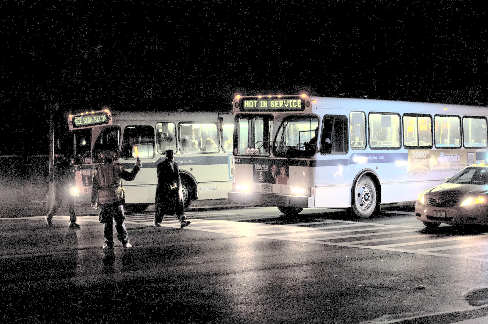         | 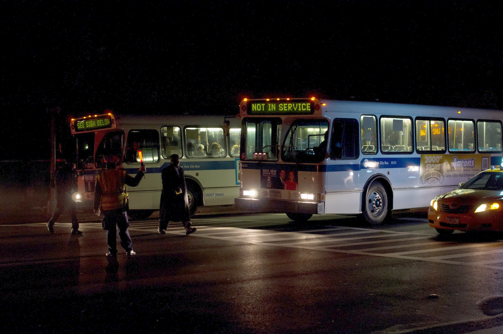         |
|  | 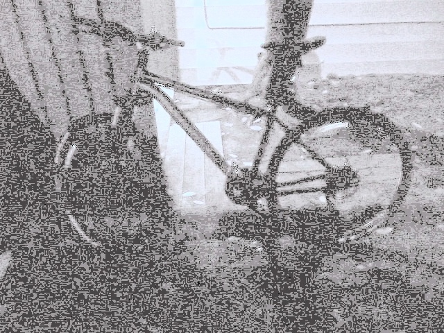 | 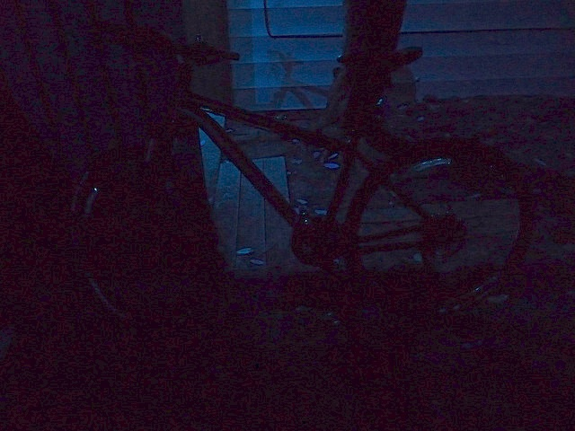 |
## Results
Object detection with pretrained weights YOLOv5 and with train on changed images on 100 epoch.

Base images have not changed.
| | Base | HistogramEqualization | AdjustingGamma |
|:----:|:----:|:----:|:----:|
|Trained |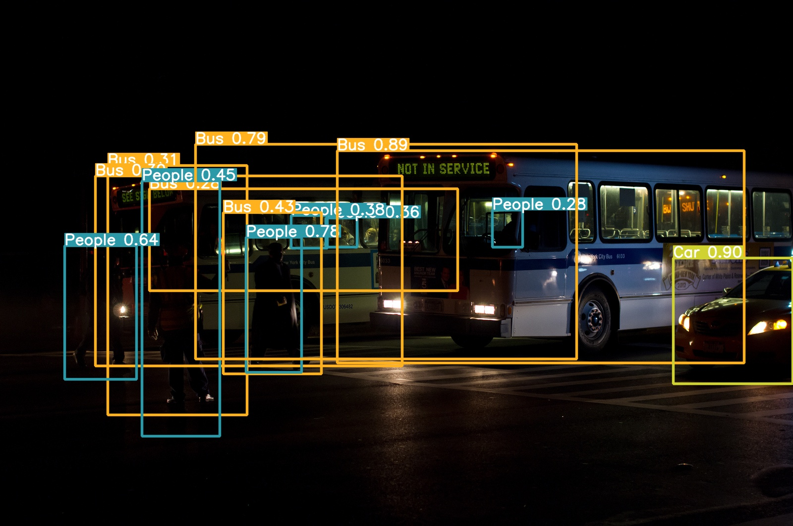 | 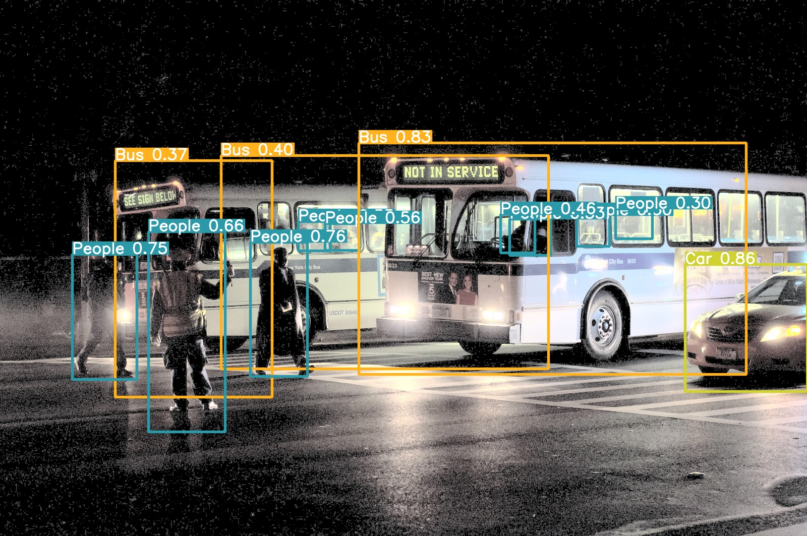 | 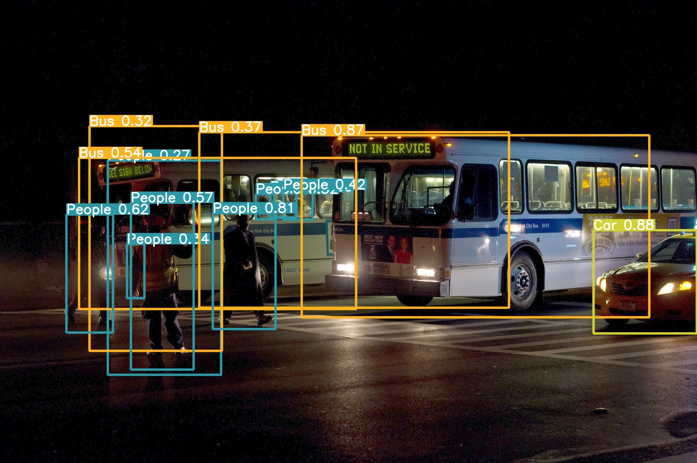 |
| Pretrained  |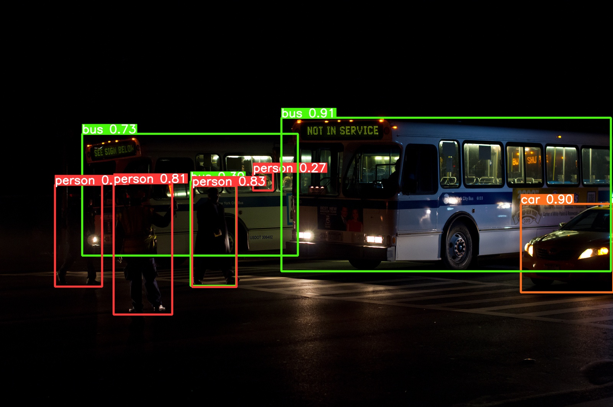 | 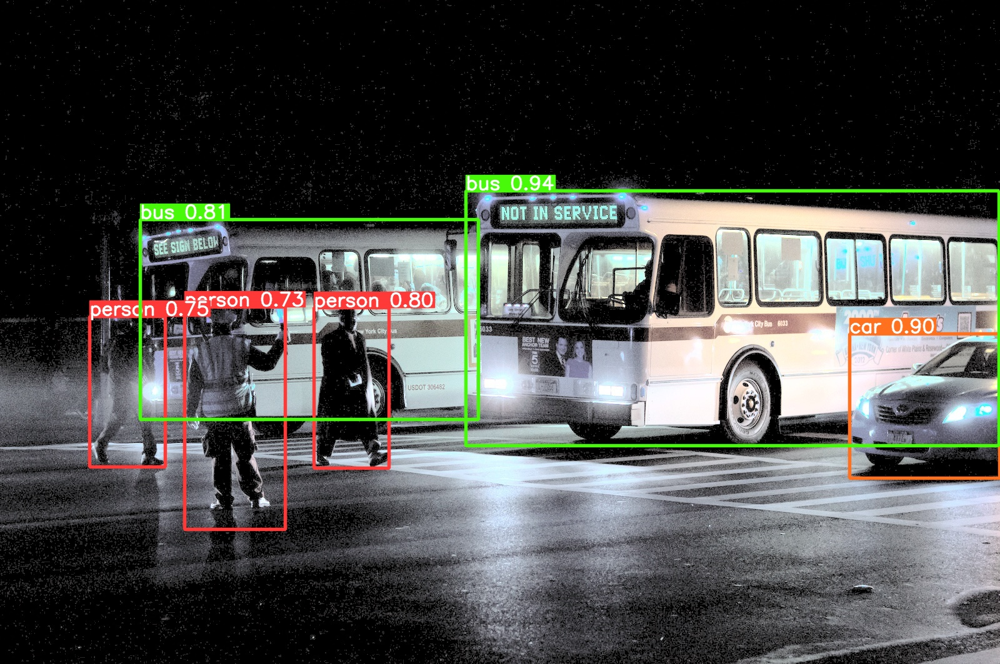 | 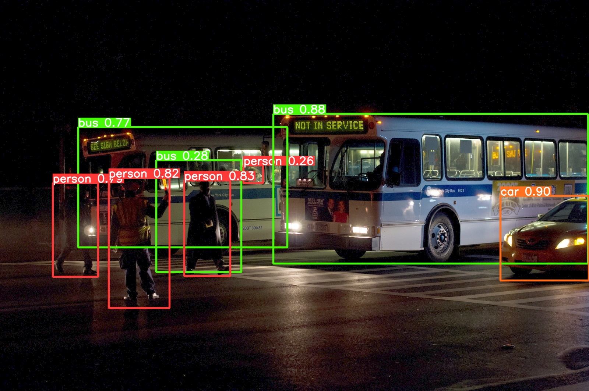 |

| | |
|:----:|:----:|
| Base |  |
| HistogramEqualization | 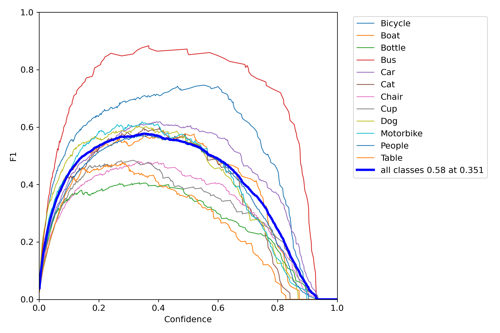 | 
| AdjustingGamma | 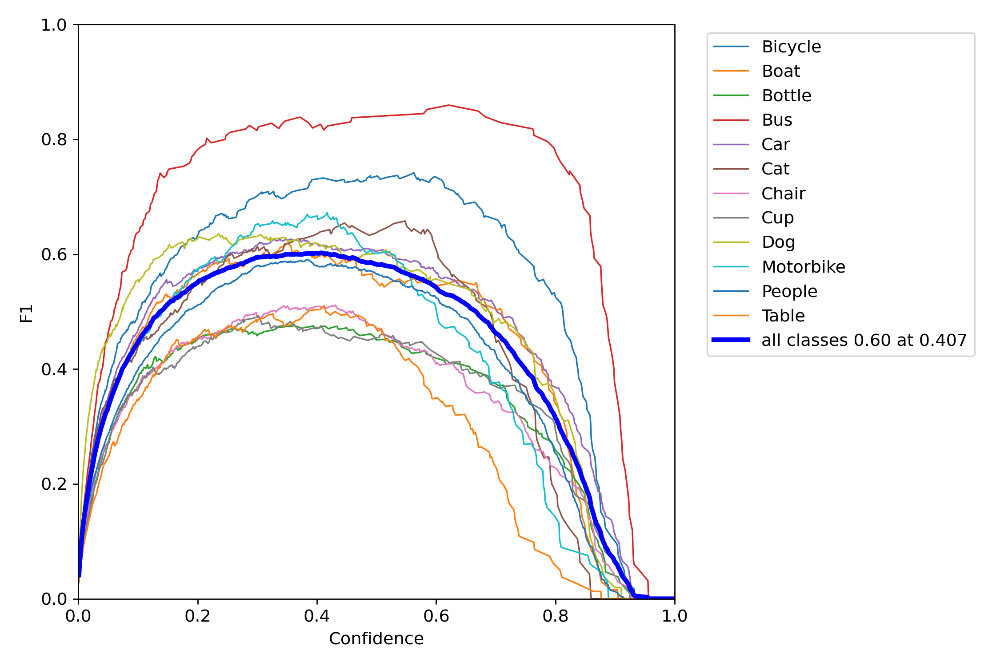 |

| | train/box_loss | train/obj_loss | train/cls_loss | metrics/precision | metrics/recall | metrics/mAP_0.5 | metrics/mAP_0.5:0.95 | val/box_loss | val/obj_loss | val/cls_loss,| x/lr0 | x/lr1 | x/lr2 |
|:----:|:----:|:----:|:----:|:----:|:----:|:----:|:----:|:----:|:----:|:----:|:----:|:----:|:----:|
| Base |0.047642|0.031714|0.015637|0.72011|0.50394|0.57431|0.30854|0.053307|0.02291|0.019558|0.0010089|0.0010089|0.0010089|
| HistogramEqualization |0.048521|0.032247|0.016837|0.67106|0.50392|0.55427|0.28576|0.053931|0.023381|0.020544|0.0010089|0.0010089|0.0010089|
| AdjustingGamma |0.047076|0.031583|0.015482|0.68633|0.54835|0.59237|0.31173|0.052462|0.022704|0.019267|0.0010089|0.0010089|0.0010089|

mAP - Mean Average Precision.
| | mAP |
|:----:|:----:|
| Base | 0.57431 |
| HistogramEqualization | 0.55427 |
| AdjustingGamma | 0.59237 |

The results show that mAP higher with adjusting gamma approach, object detection on original images works better then with histogram equalization. One of the main differences in approaches is the presence of noise in images. One of the main differences in approaches is the presence of noise in images and color distortion.

**We managed to improve mean average precision of the algorithm by 3.14% (+0.018).**
## Approaches
### Histogram Equalization
Histogram Equalization is an image processing technique that adjusts the contrast of an image by using its histogram. To enhance the image’s contrast, it spreads out the most frequent pixel intensity values or stretches out the intensity range of the image. By accomplishing this, histogram equalization allows the image’s areas with lower contrast to gain a higher contrast.
| Image | Histogram |
|:----:|:----:|
| 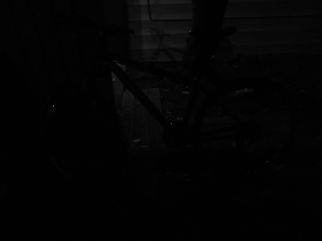 | 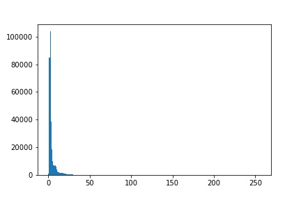 |
|  | 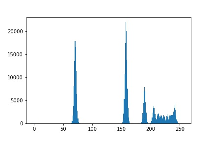 |

For colored RGB image we can't equalize each channel separately. Equalization involves Intensity values of the image not the color components. We can do it without disturbing the color balance of the image. We separate intensity values from color components by converting to [YCbCr](https://en.wikipedia.org/wiki/YCbCr) color space. And equalize intensity Y channel. It works well for exclusively dark images without many bright colours.

### Adjusting Gamma
Approach based on gamma correction of an image. We use LUT(LookUp Table) with parameter O equals image / 255 to extent of 1/gamma and multiply by 255. 

For result that we have you can use gamma = 2.0.
```
  cv2.LUT(image, np.array([((i / 255.0) ** 1.0 / gamma) * 255 for i in np.arange(0, 256)]).astype("uint8"))
```

| OriginalImage | AdjustingGamma |
|:----:|:----:|
|  |  |
## Dataset
The Exclusively Dark (ExDARK) dataset is a collection of 7,363 low-light images from very low-light environments to twilight (i.e 10 different conditions) with 12 object classes.

Class names: Bicycle, Boat, Bottle, Bus, Car, Cat, Chair, Cup, Dog, Motorbike, People, Table.
[More information and downloading:](https://github.com/cs-chan/Exclusively-Dark-Image-Dataset)
## Conclusion
We can easily improve our image detector with low light images without GAN neural networks and it will not hit the speed of the detector.

We managed to improve mean average precision of the algorithm by 3.14% (+0.018 mAP) by adjusting gamma approach.
